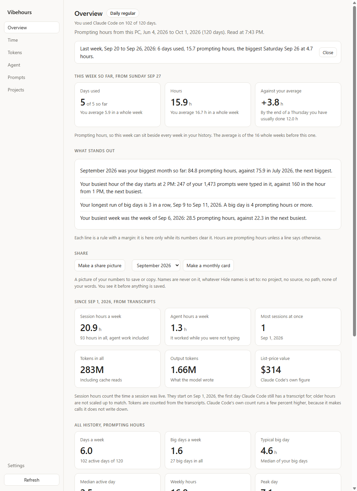
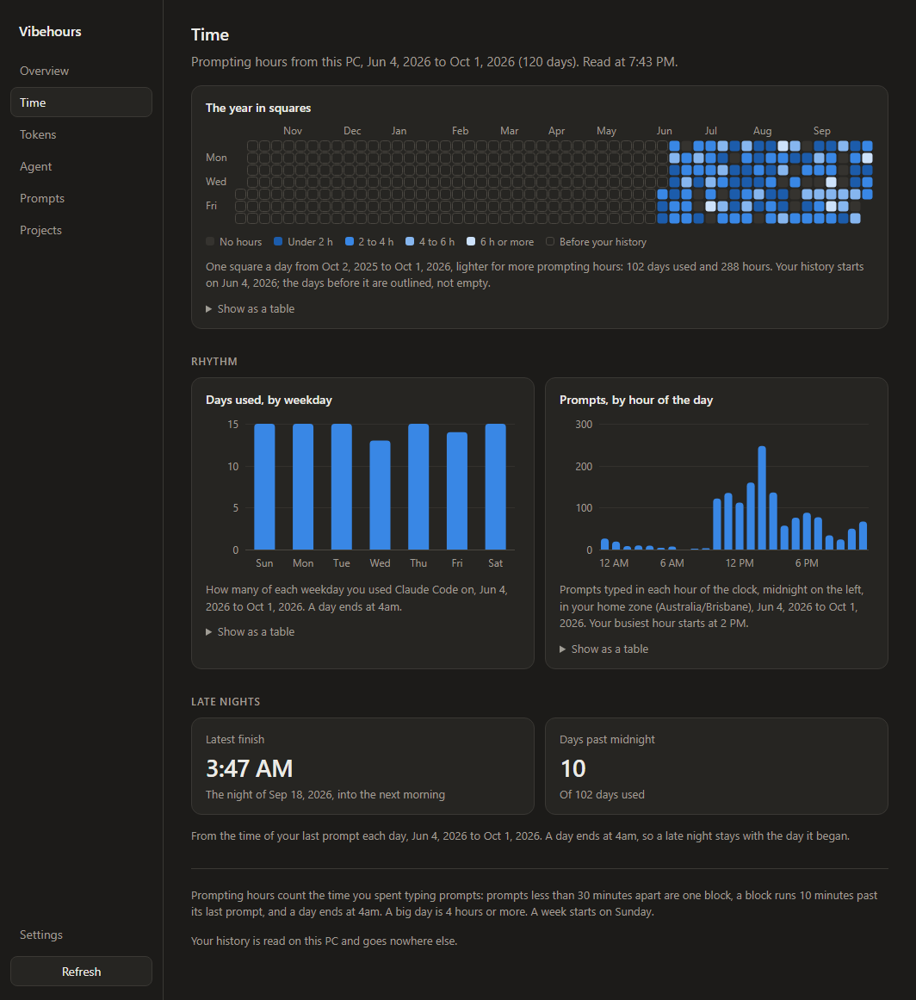
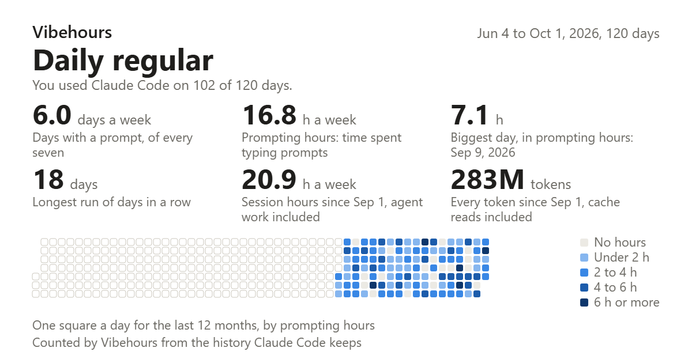

# Vibehours

See how much you vibe code. A small desktop app for Windows and Linux
that reads what Claude Code already keeps on your machine and shows
your days, hours, streaks, tokens and what they would cost at list
price.

Free and open source. Not made by, endorsed by or affiliated with
Anthropic.







The numbers in these pictures are made up.

## Download

From the [latest release](https://github.com/Jacklord1/vibehours/releases/latest):

- **Windows** - `Vibehours-Setup-<version>.exe`. The installer is not
  signed, so Windows shows "Windows protected your PC". Choose **More
  info**, then **Run anyway**. Your browser may warn about the download
  first; choose to keep it.
- **Ubuntu and Debian** - the `.deb`:
  `sudo apt install ./Vibehours-<version>-amd64.deb`.
  No person has yet seen the Linux app's window; see below.
- **Other Linux** - the AppImage. On Ubuntu 24.04 it will not start
  until `libfuse2` is installed (`sudo apt install libfuse2t64`); use
  the `.deb` there.

There is no Mac app.

The first time it opens it shows what it found: Claude Code on this
PC, and the hosts in your SSH config. Tick what to count.

## What it reads, and what it never does

It reads two things in Claude Code's `.claude` folder: `history.jsonl`,
the time of every prompt you typed, and the session transcripts under
`projects/`, which give session hours, tokens and Claude Code's own
cost figure. It reads them on this PC, and on any other machine you
tick, over the `ssh` program your PC already has.

- **No sign-in.** No account, no key.
- **No upload.** Nothing it reads leaves your machines.
- **The network, as measured.** The app's own code has no network
  call, no update check and no telemetry, and the one link in it opens
  in your browser. What the running app does was watched, because the
  first builds turned out to fetch a spell-check dictionary from
  Google on every start; that is switched off. On Linux the app runs
  under `strace` in every build, through a first run and every page,
  and the build fails if it opens an internet socket: none. On
  Windows the same run is watched with Windows' own audit of
  connections, checked first against a deliberate connection: none
  logged against the app. That audit shows connections, not name
  lookups, which Windows makes through a service of its own. What
  does use your network is `ssh`, to the hosts you tick.
- **Prompt and reply text is never written to disk.** The app keeps
  times, counts, and the names of models, tools and project folders.
  The text is dropped as each line is read.
- **Read-only on other machines.** There it runs `cat`, `find`, `wc`,
  `grep`, `xargs` and `gzip`, and changes nothing.
- **One write outside its own folder, only on yes.** Claude Code
  deletes transcripts after 30 days. The app offers once to add
  `"cleanupPeriodDays": 365` to Claude Code's settings file on this
  PC, after copying the file, or to make that file if there is none.

## How hours are counted

- Prompts less than 30 minutes apart are one block.
- A block runs from its first prompt to its last, plus 10 minutes.
- A day runs 4am to 4am in your home time zone. A week starts on
  Sunday.
- Those are prompting hours. Session hours also count the time the
  agent kept working, and two sessions at once count once.

## Why the token count runs a little under Claude Code's own

Claude Code makes some calls it does not write to the transcript, such
as session titles and summaries. Vibehours counts what the transcripts
hold, so its count for a session runs a few percent under Claude
Code's own. On the sessions it was measured on it was never above. Cost is Claude Code's own figure, at
list price; the app has no price table.

## What has been seen working, and what has not

Seen by a person on a real machine:

- The Windows app on Windows 11, reading a Linux machine over SSH.
- The same PC, which has only the Claude desktop app's Code sessions
  and no terminal prompt history, read as This PC beside that Linux
  machine: found, said plainly, and its typed-prompt times taken from
  its transcripts.

Seen only in pictures the app draws of itself off screen, on made-up
data, on Windows and Linux build machines:

- Every page, light and dark, narrow and wide.
- Claude Code on this PC with a terminal prompt history, on Linux and
  on Windows.

Not seen:

- **No person has yet seen the Linux app's window.** The `.deb`
  installs and starts on Ubuntu 24.04 with no screen attached, and
  the pictures above are drawn off screen. The Linux downloads ship
  on that and nothing more.
- Claude Code installed in a terminal on Windows itself, read as This
  PC.
- A macOS machine over SSH.
- Save as PNG and Copy on a share picture.
- Claude Code inside Linux on Windows (WSL) is not read at all.

If something is wrong on your machine, open an issue.

## More

[How it works](docs/how-it-works.md): every page, what is kept, and
how each number is counted.

## Build it yourself

Needs Node 22.

```
npm install
npm test            # builds, then runs the tests
npm start           # runs the app
npm run dist:win    # makes the Windows installer (on Windows)
npm run dist:linux  # makes the AppImage and the .deb (on Linux)
```

The counting lives in `src/engine/` and has no Electron in it. To look
at the app without your own data, `node scripts/fake-home.js <folder>`
makes a made-up home folder to point it at.

## Licence

MIT. See [LICENSE](./LICENSE).
